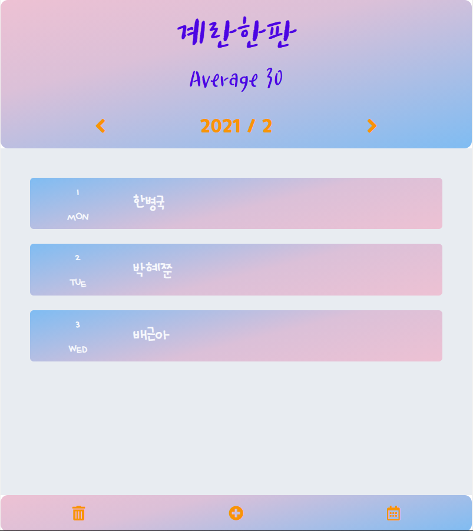
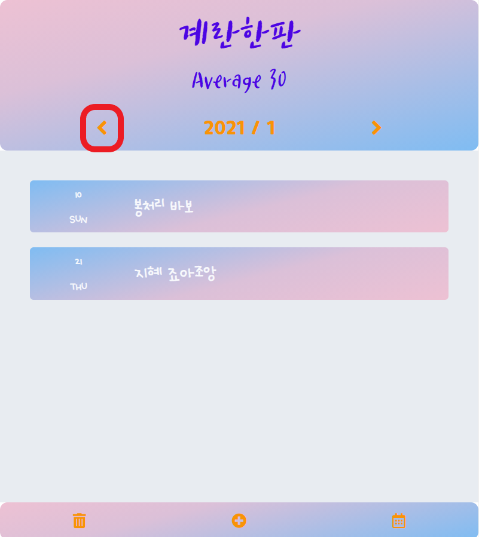
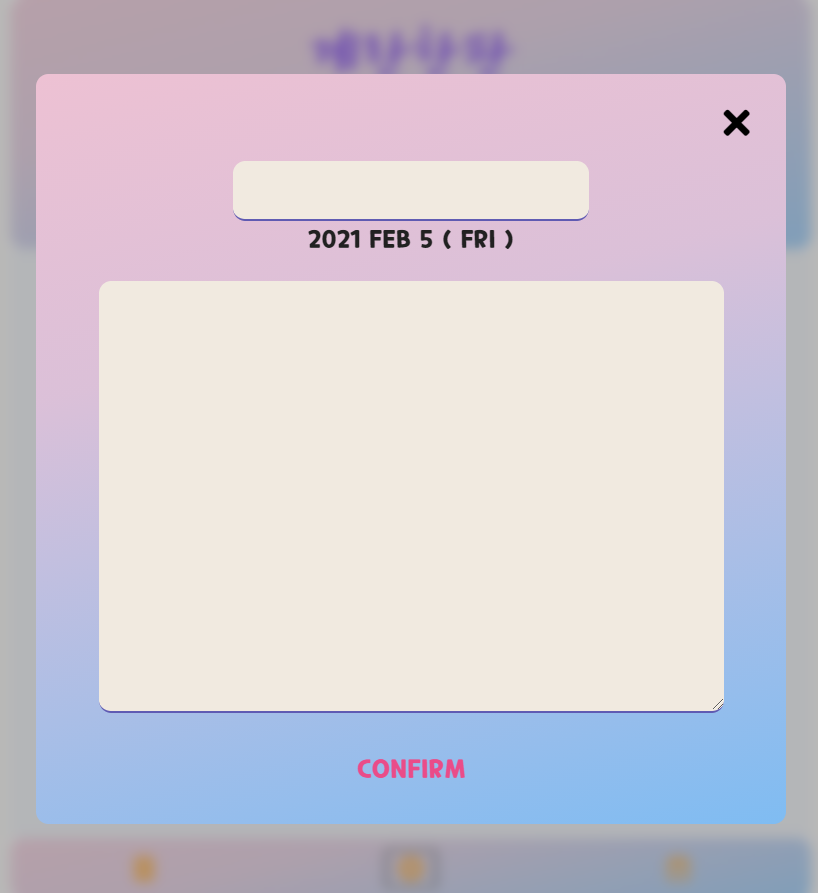
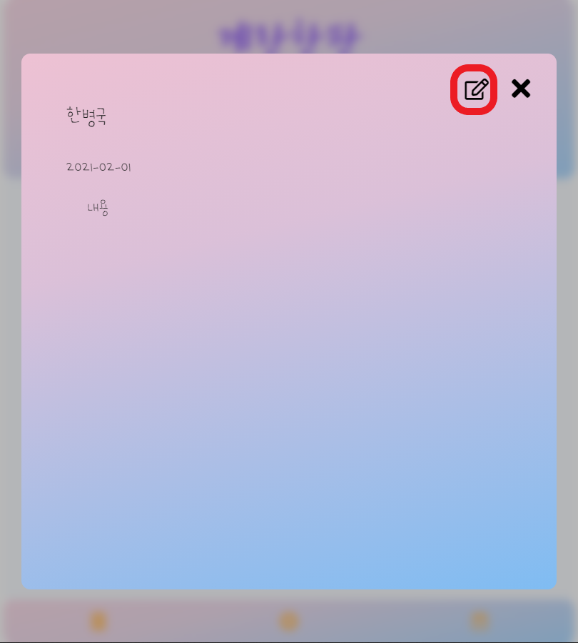
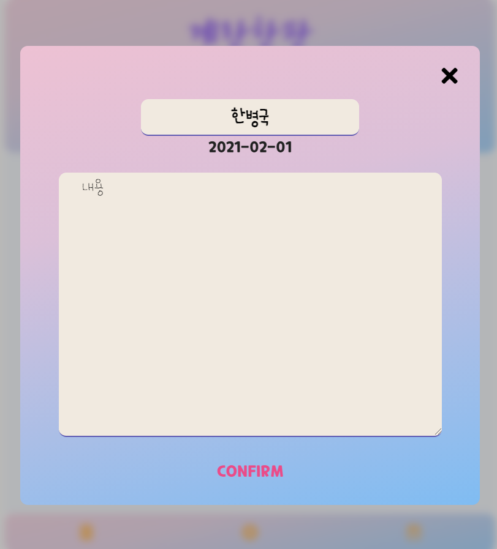
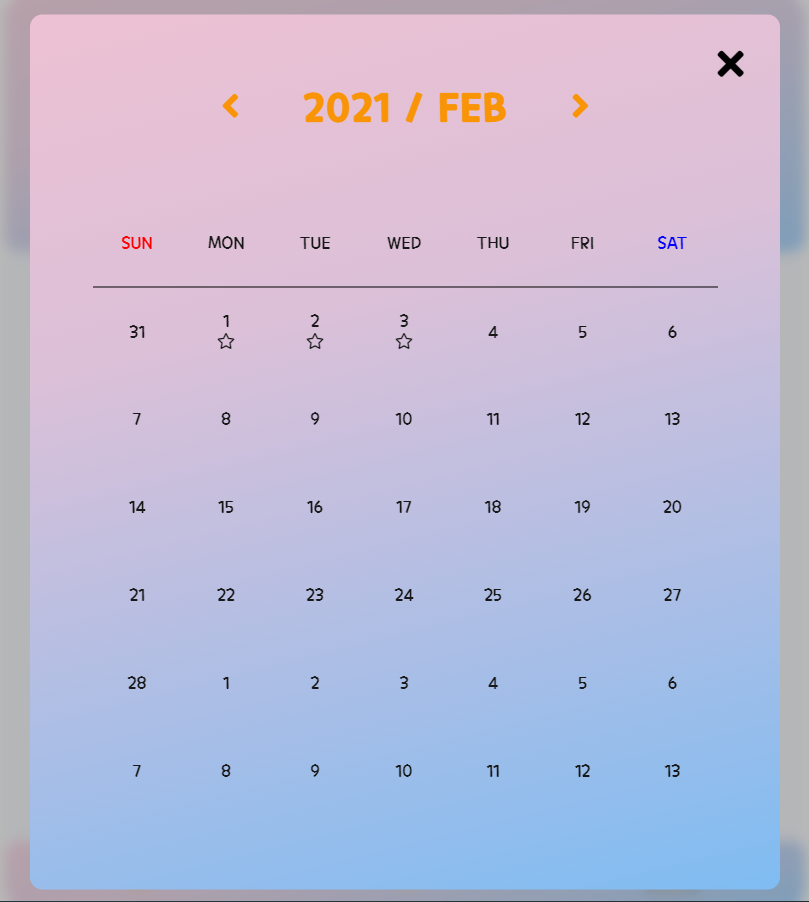

# Web Diary

바닐라 자바스크립트 웹 다이어리 프로젝트

## TEAM : 계란한판 (Average 30)
한병국 @bg_shorthand  
박혜준 @margu31  
배근아 @green9930

## 기획 의도 및 목표
수업에서 배운 기능을 최대한 사용해볼 수 있는 애플리케이션을 만들어보자!

- 바닐라 스크립트 기능 구현
- 자바스크립트 모듈 관리를 경험 
- 비동기 처리 실습 (`axios`, `async`, `await` 활용)
- Fake Server 경험
- git/github을 통한 협업

## 주요 기능
- 다이어리 작성 및 수정
- 월별 다이어리 목록 확인
- 캘린더에서 다이어리 업데이트 상황 확인

## Stack
- Vanilla JavaScript
- Webpack / Babel
- Express
- Axios
- HTML / CSS
- Git / Github
 
## Convention
- BEM
- ESLint (AirBnB Guide)

---

## Interview
### 한병국

### 박혜준

### 배근아

---

## 시연

